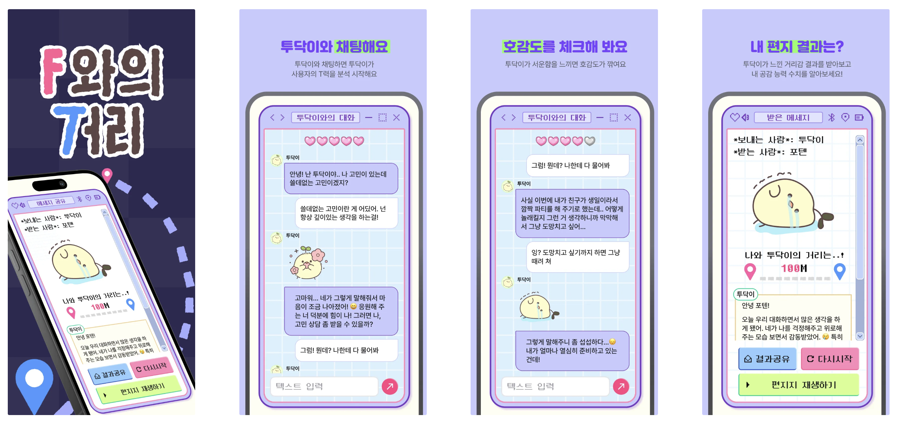
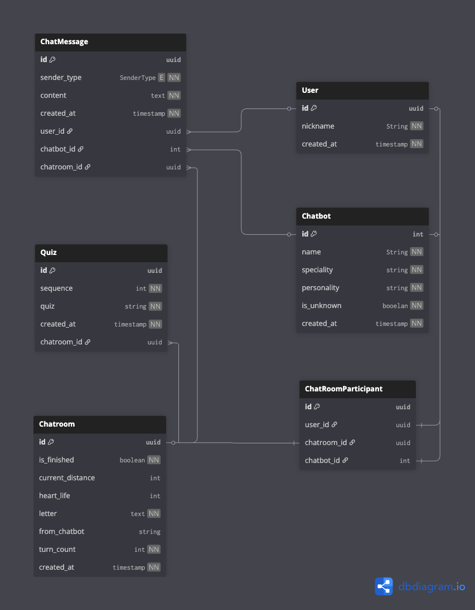
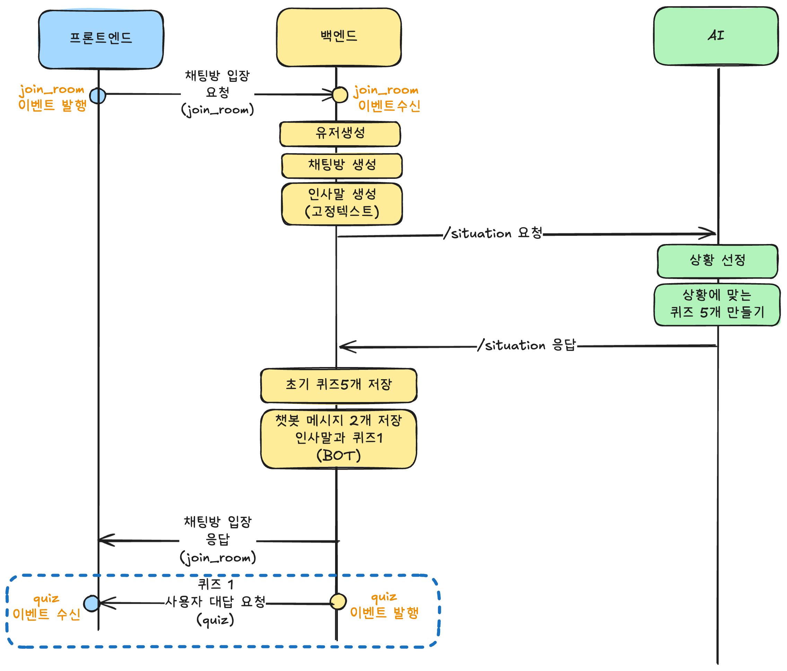
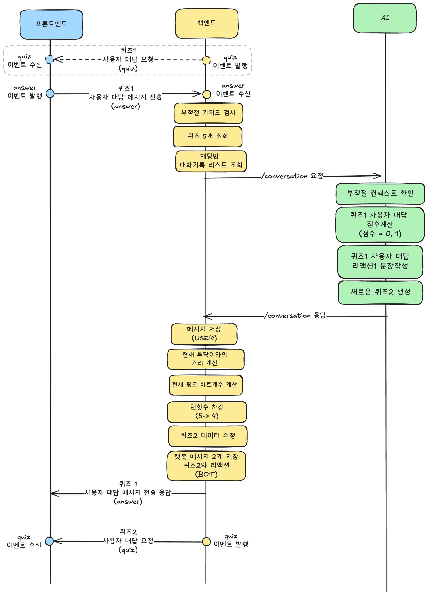
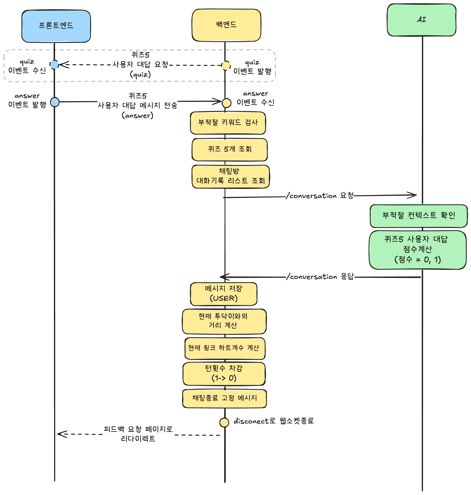
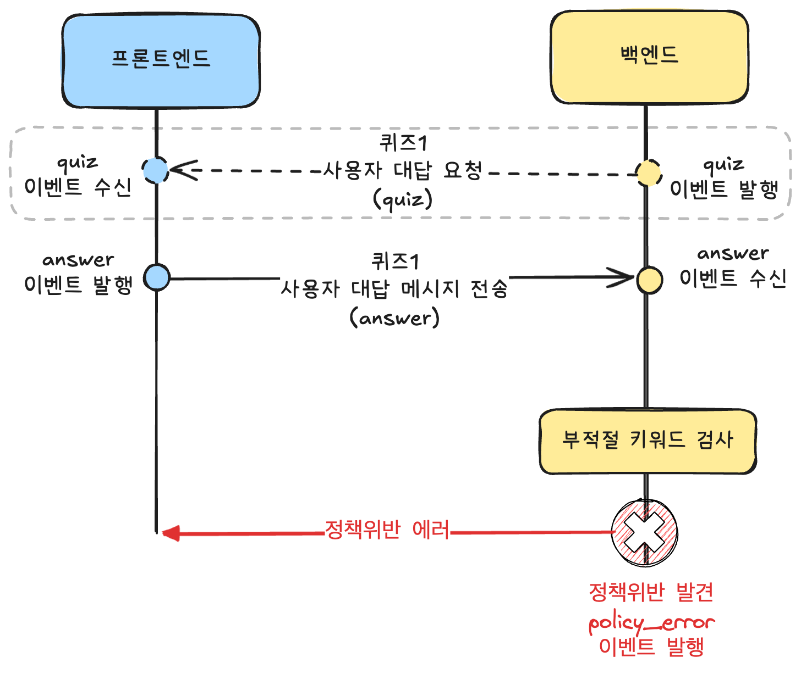
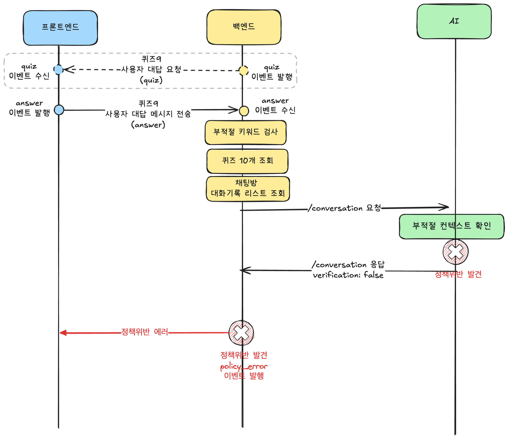

## 목차

- [목차](#목차)
- [프로젝트 소개](#프로젝트-소개)
- [ERD 다이어그램](#erd-다이어그램)
- [시퀀스 다이어그램](#시퀀스-다이어그램)
  - [채팅방 입장 프로세스](#채팅방-입장-프로세스)
  - [챗봇 질문에 대한 사용자 응답 프로세스](#챗봇-질문에-대한-사용자-응답-프로세스)
  - [챗봇 질문에 대한 사용자 응답메시지 정책위반 프로세스](#챗봇-질문에-대한-사용자-응답메시지-정책위반-프로세스)
  - [챗봇의 마지막편지](#챗봇의-마지막편지)
- [프로젝트 구조](#프로젝트-구조)
  - [전체 프로젝트 파일 구조](#전체-프로젝트-파일-구조)
- [REST API 정의서](#rest-api-정의서)
  - [챗봇목록 조회](#챗봇목록-조회)
  - [챗봇 마지막 편지 조회](#챗봇-마지막-편지-조회)
- [Websocket 이벤트에 대한 응답](#websocket-이벤트에-대한-응답)
- [프로젝트 셋팅 방법](#프로젝트-셋팅-방법)
  - [프로젝트 초기 셋팅](#프로젝트-초기-셋팅)
  - [프로젝트 실행](#프로젝트-실행)
  - [단위테스트 케이스 실행](#단위테스트-케이스-실행)

---

## 프로젝트 소개



> 프로젝트 시연영상

<https://github.com/user-attachments/assets/d3375fd6-f3cd-4e8f-a110-ff36fb10ef76>

<br>

> 백엔드 파트 사용 기술스택

- Language / Framework / Package-Manager:   
- Web Socket: 
- Testing: 
- RDBMS / NoSQL:  
- Cloud: 
- EC2, ALB(Application Load Balancer), Route53, ACM, S3, VPC
- CI/CD:  

---

## ERD 다이어그램


- [dbdiagram link - Na-T-Na ERD](https://dbdiagram.io/d/na-T-na-BE-ERD-688b84b6cca18e685caf46b2)



<br>

---

## 시퀀스 다이어그램

### 채팅방 입장 프로세스



<br><br>

### 챗봇 질문에 대한 사용자 응답 프로세스

> 첫번째 질문(quiz)에 대한 사용자 답변과 챗봇 리액션 진행 프로세스



<br>

> 마지막 질문(5번째 질문)에 대한 사용자 답변과 챗봇 리액션 진행 프로세스



<br><br>

### 챗봇 질문에 대한 사용자 응답메시지 정책위반 프로세스

> 사용자의 답변에서 부적절한 특정 키워드(예: '자살', '테러', '우울' 등) 가 포함한 경우



> 사용자의 답변에서 비속어, 욕설 과 같은 불쾌감 유발 및 부적절한 문맥흐름 감지하거나 프롬프트 탈취 할 경우



<br><br>

### 챗봇의 마지막편지

> 채팅 종료 후, 챗봇의 마지막편지를 요청해야하는 경우 (`is_finished = false`)


<br>

> 이미 챗봇의 마지막편지를 받은 경우 (`is_finished = true` )


---

## 프로젝트 구조

- 7개의 도메인을 주축으로 모듈생성
  비즈니스를 이루는 도메인은 `Chatbot`, `Chatroom`, `Message`, `Quiz`,`Quiz`, `User` 으로 각 6개는 독립적인 모듈과 프로바이더로 구성되어있습니다.

- 클린아키텍쳐와 레이어드아키텍쳐을 모델로 프로젝트의 각 도메인별 계층을 구성하였습니다.
- 각 도메인에는 `domain`, `presentation`, `infrastructure` 3개의 계층을 갖고있습니다.
  - `domain`
    - 해당 도메인의 비즈니스룰과 핵심을 나타냅니다.
    - 서비스로직, 비즈니스규칙, 래포지토리 인터페이스, 서비스 unit-test 로 구성되어있습니다.
  - `presentation`
    - 컨트롤러(REST API), 게이트웨이(Web-Socket) 등 에 해당되며, API요청할때 먼저 접근되는 프레젠테이션 및 이벤트/URL 라우팅 계층을 의미합니다.
  - `infrastructure`
    - 도메인계층에서는 래포지토리 인터페이스이며, 인터페이스의 실제 구현체를 의미합니다. 데이터베이스와 연결된 ORM을 이용하여 query에 알맞는 리스폰스를 응답합니다.

```bash
chatbots
├─ chatbots.module.ts
├─ domain
│  ├─ chatbot-with-personalities.type.ts
│  ├─ chatbot.policy.ts
│  ├─ chatbot.repository.interface.ts
│  ├─ chatbots.service.test.ts
│  └─ chatbots.service.ts
├─ infrastructure
│  └─ chatbot.repository.ts
└─ presentation
   ├─ chatbots.controller.ts
   └─ dto
        └─ get-chatbots.response.dto.ts
```

### 전체 프로젝트 파일 구조

```bash
📦
├─ .dockerignore
├─ .env.test
├─ .github
│  └─ workflows
│     ├─ deploy-production.yml
│     └─ test.yml
├─ .gitignore
├─ .prettierrc
├─ .vscode
│  └─ launch.json
├─ Dockerfile
├─ README.md
├─ docker-compose.yml
├─ eslint.config.mjs
├─ jest.config.json
├─ nest-cli.json
├─ package.json
├─ prisma
│  ├─ first-chatbot-seeds.ts
│  └─ schema.prisma
├─ src
│  ├─ app.controller.spec.ts
│  ├─ app.controller.ts
│  ├─ app.module.ts
│  ├─ app.service.ts
│  │
│  ├─ chatbots
│  │  ├─ chatbots.module.ts
│  │  ├─ domain
│  │  │  ├─ chatbot-with-personalities.type.ts
│  │  │  ├─ chatbot.policy.ts
│  │  │  ├─ chatbot.repository.interface.ts
│  │  │  ├─ chatbots.service.test.ts
│  │  │  └─ chatbots.service.ts
│  │  ├─ infrastructure
│  │  │  └─ chatbot.repository.ts
│  │  └─ presentation
│  │     ├─ chatbots.controller.ts
│  │     └─ dto
│  │        └─ get-chatbots.response.dto.ts
│  │
│  ├─ chatrooms
│  │  ├─ chatrooms.module.ts
│  │  ├─ domain
│  │  │  ├─ chatroom-feedback-buisness-rule.ts
│  │  │  ├─ chatroom.repository.interface.ts
│  │  │  ├─ chatrooms.service.spec.ts
│  │  │  ├─ chatrooms.service.ts
│  │  │  └─ chatting-socket-business-rule.ts
│  │  ├─ infrastructure
│  │  │  └─ chatroom.repository.ts
│  │  └─ presentation
│  │     ├─ chatrooms.controller.ts
│  │     ├─ chatrooms.gateway.ts
│  │     └─ dto
│  │        ├─ answer.dto.ts
│  │        ├─ get-last-letter.dto.ts
│  │        └─ join-room.dto.ts
│  │
│  ├─ common
│  │  ├─ S3_URL.ts
│  │  ├─ common.module.ts
│  │  ├─ custom-exceptions
│  │  │  ├─ base-custom-exception.ts
│  │  │  └─ policy-errors.ts
│  │  ├─ global-exception.filter.ts
│  │  ├─ swagger-mock-api.service.ts
│  │  ├─ swagger-mock.interceptor.spec.ts
│  │  └─ swagger-mock.interceptor.ts
│  │
│  ├─ external-api
│  │  ├─ dto
│  │  │  ├─ request-chatbot-reaction-from-conversation.dto.ts
│  │  │  ├─ request-create-situation.dto.ts
│  │  │  └─ request-feedback.dto.ts
│  │  ├─ external-api.module.ts
│  │  ├─ external-api.service.spec.ts
│  │  └─ external-api.service.ts
│  │
│  ├─ main.ts
│  │
│  ├─ messages
│  │  ├─ domain
│  │  │  ├─ message-business-rule.ts
│  │  │  ├─ message.cache-store.interface.ts
│  │  │  ├─ message.repository.interface.ts
│  │  │  ├─ message.type.ts
│  │  │  ├─ messages.service.spec.ts
│  │  │  └─ messages.service.ts
│  │  ├─ infrastructure
│  │  │  ├─ message.cache-store.ts
│  │  │  └─ message.repository.ts
│  │  └─ messages.module.ts
│  │
│  ├─ prisma
│  │  ├─ prisma.module.ts
│  │  └─ prisma.service.ts
│  │
│  ├─ quizes
│  │  ├─ domain
│  │  │  ├─ dto
│  │  │  │  └─ update-quiz.dto.ts
│  │  │  ├─ quiz-list.type.ts
│  │  │  ├─ quiz.cache-store.interface.ts
│  │  │  ├─ quiz.repository.interface.ts
│  │  │  ├─ quizes.service.spec.ts
│  │  │  └─ quizes.service.ts
│  │  ├─ infrastructure
│  │  │  ├─ quiz.cache-store.ts
│  │  │  └─ quiz.repository.ts
│  │  └─ quizes.module.ts
│  │
│  ├─ redis
│  │  ├─ redis.module.ts
│  │  ├─ redis.service-integration.test.ts
│  │  ├─ redis.service.interface.ts
│  │  └─ redis.service.ts
│  │
│  └─ users
│     ├─ domain
│     │  ├─ create-user.dto.ts
│     │  ├─ user.policy.ts
│     │  ├─ user.repository.interface.ts
│     │  ├─ users.service.spec.ts
│     │  └─ users.service.ts
│     ├─ infrastructure
│     │  └─ user.repository.ts
│     ├─ presentation
│     │  └─ users.controller.ts
│     └─ users.module.ts
├─ test
│  └─ jest-e2e.json
├─ tsconfig.build.json
├─ tsconfig.json
└─ yarn.lock

```

---

## REST API 정의서

### 챗봇목록 조회

| Method | URL             | 목적          |
| ------ | --------------- | ------------- |
| GET    | `/api/chatbots` | 챗봇목록 조회 |

> 예시 응답데이터

```json
{
  "chatbots": [
    {
      "chatbot_id": 1,
      "chatbot_profile_image": "{S3-URL}/chatbots/1/profile.png",
      "chatbot_name": "투닥이",
      "chatbot_personalities": "당신의 이야기에 감정 200% 몰입",
      "chatbot_speciality": "공감 스킬 향상을 위한 조력 메이트",
      "is_unknown": false
    },
    {
      "chatbot_id": 2,
      "chatbot_profile_image": "{S3-URL}/chatbots/2/unknown.png",
      "chatbot_name": "썸고수_???",
      "chatbot_personalities": "???",
      "chatbot_speciality": "연애 공감 시뮬레이션",
      "is_unknown": true
    }
  ]
}
```

### 챗봇 마지막 편지 조회

| Method | URL                                                                     | 목적                   |
| ------ | ----------------------------------------------------------------------- | ---------------------- |
| GET    | `/api/chatrooms/{chatroom_id}/letters`<br />- chatroom_id: uuid(string) | 챗봇의 마지막편지 조회 |

> 예시 응답 데이터

```json
{
  "chatroom_id": "{uuid}",
  "is_finished": true,
  "current_distance": 10,
  "letter": "{투닥이가 보내는 편지 내용}",
  "user_nickname": "사용자 닉네임",
  "chatbot_name": "투닥이",
  "chatbot_id": 1,
  "from_chatbot": "힘들었던 하루 끝에, \n 투닥이"
  "letter_mp3": "{S3-URL}/chatrooms/results/{chatroom_id}/letter_voice.mp3",
  "chatbot_result_image": "{S3-URL}/chatbots/{chatbot_id}/results/result_0.png"
}
```

<br>

> 설명

| 필드명               | 데이터 타입  | 정의                                                          |
| -------------------- | ------------ | ------------------------------------------------------------- |
| chatroom_id          | string(uuid) | 채팅방 PK                                                     |
| is_finished          | boolean      | 편지지작성 완료 여부 - 작성완료: true - 미완성(채팅중): false |
| current_distance     | int          | 챗봇과의 사이거리                                             |
| letter               | string       | 마지막 편지 내용                                              |
| user_nickname        | string       | 사용자 닉네임                                                 |
| chatbot_id           | int          | 챗봇 PK                                                       |
| chatbot_name         | string       | 챗봇 이름                                                     |
| letter_mp3           | string(url)  | 마지막 편지 내용 음성파일 url                                 |
| chatbot_result_image | string(url)  | 마지막 편지 결과 이미지 url                                   |
| from_chatbot         | string       | {AI작성 마지막 안부인사},{챗봇명}                             |

<br>

> 챗봇 결과이미지 파일(chatbot_result_image) 조건

| 하트개수<br />heart_life | 챗봇과의 거리<br />(current_distance) | 챗봇결과 이미지파일<br />chatbot_result_image | 설명                          |
| :----------------------: | ------------------------------------- | --------------------------------------------- | ----------------------------- |
|            0             | 5                                     | result_0.png                                  | 챗봇과 사이거리가 가장 멀다   |
|            1             | 4                                     | result_1.png                                  |                               |
|           2~3            | 3~2                                   | result_2.png                                  |                               |
|            4             | 1                                     | result_3.png                                  |                               |
|            5             | 0                                     | result_4.png                                  | 챗봇과 사이거리가 가장 가깝다 |

---

## Websocket 이벤트에 대한 응답

(tbd)

---

## 프로젝트 셋팅 방법

### 프로젝트 초기 셋팅

- Mysql8.0, Reids 먼저 설치 권장
- 도커실행을 하게되면 아래 명령어로 로컬환경 도커 셋팅을 한다.

```bash
docker-compose up -d
```

- 프로젝트 사용 패키지 인스톨

```bash
yarn install
```

- 연결된 데이터베이스에 prisma ORM 반영하기

```bash
npx prisma generate
npx prisma db push
```

- 초기 챗봇(투닥이) 데이터 초기셋팅

```bash
npx prisma db seed
```

### 프로젝트 실행

```bash
# 일반 실행
$ yarn run start

# 개발모드
$ yarn run start:dev

```

### 단위테스트 케이스 실행

```bash
# unit tests
$ yarn run test

```
